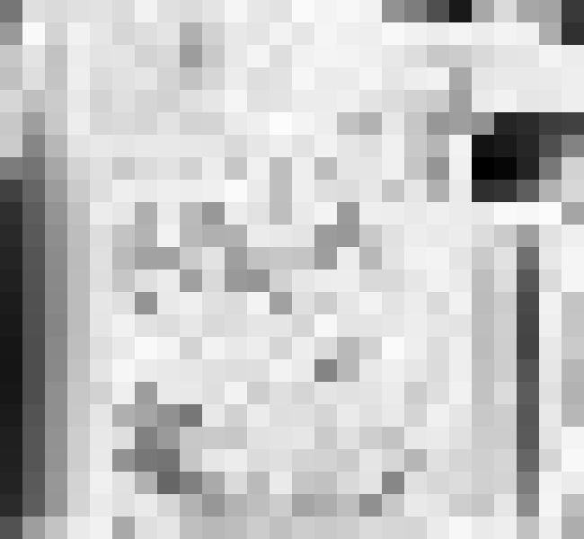
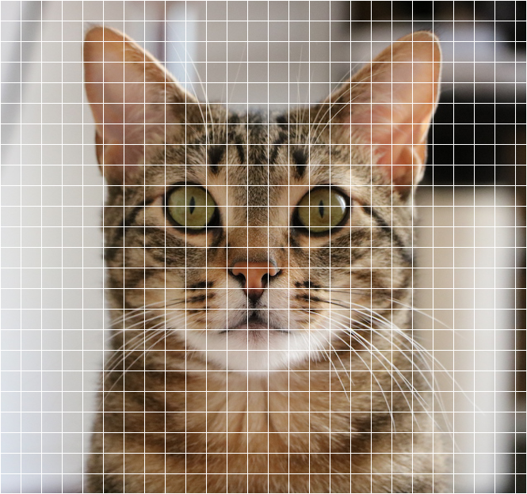
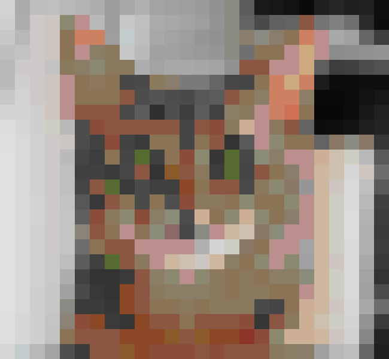
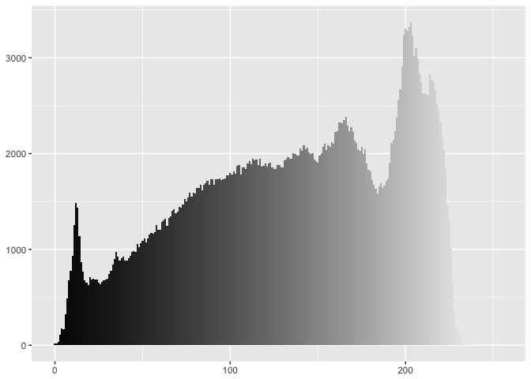
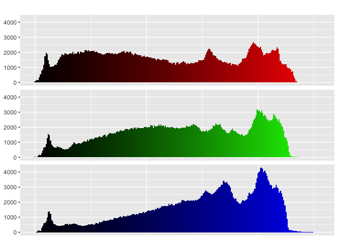

[](https://travis-ci.org/ThinkRstat/collage)

<!-- README.md is generated from README.Rmd. Please edit that file -->
Meet Tigrou


``` r
library(collage)
library(magick)

tigrou <- image_read( system.file("tigrou", "tigrou.jpg", package = "collage") )
```

collage
-------

Tigrou with every 25x25 replaced by another kitty

``` r
collage( tigrou, tiles = kittens, size = 25)
#>   format width height colorspace filesize
#> 1    png  1300   1200       sRGB        0
```


with every 10x10 replaced by a useR 2017 attendee:

``` r
collage( tigrou, tiles = useR2017, size = 10)
#>   format width height colorspace filesize
#> 1    png  3200   3000       sRGB        0
```


collage\_quality
----------------

A measure of the quality of the tiles.

``` r
collage_quality( tigrou, tiles = kittens, size = 25)
#>   format width height colorspace filesize
#> 1    png   650    600       sRGB        0
```



collage\_grid
-------------

Showing the grid

``` r
collage_grid( tigrou, size = 25)
#>   format width height colorspace filesize
#> 1    png   665    624       sRGB        0
```



tiles
-----

The tiles argument of these functions expect a tibble similar to the `kittens` (or `puppies`) that is shipped with the package:

``` r
kittens
#> # A tibble: 400 x 5
#>      red green  blue alpha         tile
#>    <raw> <raw> <raw> <raw>       <list>
#>  1    81    4e    50    ff <S3: bitmap>
#>  2    b5    a9    a8    ff <S3: bitmap>
#>  3    ad    a4    9c    ff <S3: bitmap>
#>  4    a6    99    89    ff <S3: bitmap>
#>  5    a4    69    47    ff <S3: bitmap>
#>  6    cb    a9    aa    ff <S3: bitmap>
#>  7    82    74    57    ff <S3: bitmap>
#>  8    74    5e    4a    ff <S3: bitmap>
#>  9    94    81    8b    ff <S3: bitmap>
#> 10    86    85    83    ff <S3: bitmap>
#> # ... with 390 more rows
puppies
#> # A tibble: 400 x 5
#>      red green  blue alpha         tile
#>    <raw> <raw> <raw> <raw>       <list>
#>  1    96    7b    5f    ff <S3: bitmap>
#>  2    71    72    50    ff <S3: bitmap>
#>  3    47    46    43    ff <S3: bitmap>
#>  4    a1    85    70    ff <S3: bitmap>
#>  5    6a    70    74    ff <S3: bitmap>
#>  6    5d    60    53    ff <S3: bitmap>
#>  7    a3    8c    5d    ff <S3: bitmap>
#>  8    ac    9d    8b    ff <S3: bitmap>
#>  9    79    6f    5d    ff <S3: bitmap>
#> 10    70    72    70    ff <S3: bitmap>
#> # ... with 390 more rows
```

Each row represent a tile, which has a given color (identified by the `red`, `green`, `blue` and `alpha` columns). The `tile` column is a list column holding the data for the tiles.

``` r
kittens$tile[[1]]
#> 4 channel 50x50 bitmap array: 'bitmap' raw [1:4, 1:50, 1:50] 0d 0f 0e ff ...
```

The `tiles` function can make one of these tiles tibbles:

``` r
files   <- list.files( system.file("base", package = "collage"), pattern = "jpg$", full.names = TRUE )
samples <- tiles( files, size = 25 )
samples
#> # A tibble: 54 x 5
#>      red green  blue alpha         tile
#>    <raw> <raw> <raw> <raw>       <list>
#>  1    90    9c    a2    ff <S3: bitmap>
#>  2    d2    ae    a5    ff <S3: bitmap>
#>  3    dc    aa    b6    ff <S3: bitmap>
#>  4    c6    88    95    ff <S3: bitmap>
#>  5    bc    93    ac    ff <S3: bitmap>
#>  6    8c    5a    3b    ff <S3: bitmap>
#>  7    7c    75    6f    ff <S3: bitmap>
#>  8    8b    8d    a0    ff <S3: bitmap>
#>  9    82    7a    62    ff <S3: bitmap>
#> 10    a7    b0    8c    ff <S3: bitmap>
#> # ... with 44 more rows
```

tiles\_mono
-----------

The `tiles_mono` function generates monochromatic tiles. For example, here is Tigrou with each 25x25 square replaced by the closest R color.

``` r
rtiles <- tiles_mono(colors())
collage( tigrou, tiles = rtiles, size = 25)
#>   format width height colorspace filesize
#> 1    png   650    600       sRGB        0
```



tiles\_animals
--------------

The `tiles_animals` function scraps data. For example, the `kittens` and `puppies` have been generated with :

``` r
kittens <- tiles_animals(what = "bebe,chats", pages = 1:20)
puppies <- tiles_animals(what = "bebe,chiens", pages = 1:20)
```

histograms
----------

Histograms are a tool used in photography to visualise brightness of images. `image_histogram_data` measures the number of pixels for each tone (from 0 to 255) in a picture.

``` r
image_histogram_data(tigrou)
#> # A tibble: 256 x 4
#>     tone   red green  blue
#>    <int> <int> <int> <int>
#>  1     0     1    23    77
#>  2     1     4     2   134
#>  3     2    39    15   173
#>  4     3   107    98   147
#>  5     4   130   166   331
#>  6     5   101   137   522
#>  7     6   273   280   757
#>  8     7   425   461   878
#>  9     8   595   636  1157
#> 10     9   620   692  1731
#> # ... with 246 more rows
```

Then `image_histogram_brightness` and `image_histogram_rgb` shows brightness and individual channel histograms:

``` r
image_histogram_brightness(tigrou)
```



``` r
image_histogram_rgb(tigrou)
```


